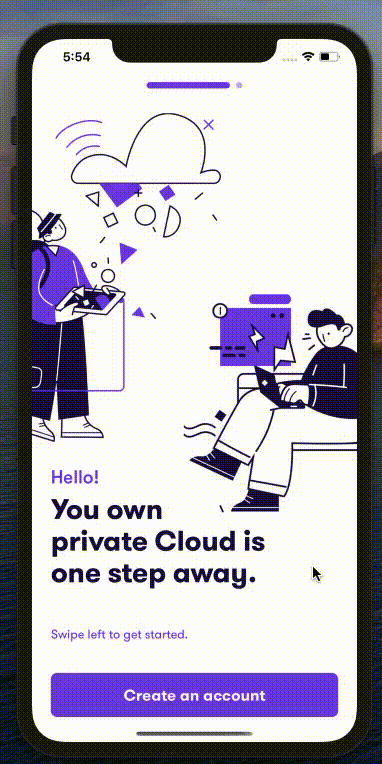
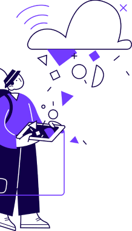
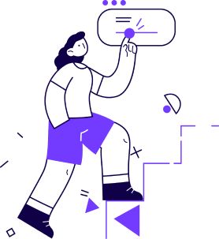
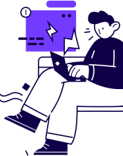

# Ubiquitous UI

After seeing an application run on a mobile phone, ever thought maybe someday you would like to make your own? How would you feel if we told you that you could make an application run on both Android and iOS mobiles by writing code in just one language? Well, today you get to do just that. Using Google’s framework, Flutter, you can do this easily. For your task, you need to make a simple user interface just like the one given below. 

References: 
- [Flutter Installation](https://flutter.dev/docs/get-started/install)
- [Flutter Docs](https://flutter.dev/docs)
- [Tabs in Flutter](https://flutter.dev/docs/cookbook/design/tabs)
- [Making the dot animated when changing tabs](https://pub.dev/packages/dots_indicator)

**Note: To be able to run the same application on an iOS device, you need to have a Mac with XCode in it. You can run the application on just an Android/iOS/emulator device as per the hardware available to you.**

## Sample UI

## [Resources](./resources)
| @1x	| @2x	| @3x	|
|-	|-	|-	|
|  |  |  |
|  |  |  |
|  |  |  |
